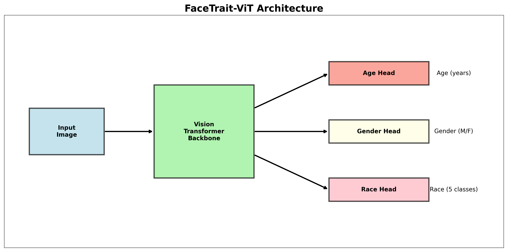

# FaceTrait-ViT: A Vision Transformer for Demographic Analysis


**FaceTrait-ViT** is a multi-task learning model based on the **Vision Transformer (ViT)** architecture, designed to simultaneously predict **age, gender**, and **race** from facial images using the **UTKFace** dataset.

---

## 🔑 Key Features

* **Multi-Task Learning**: Single model for age regression, gender, and race classification
* **ViT Architecture**: Leverages self-attention mechanisms for superior feature extraction
* **High Accuracy**: Achieves strong performance across all three demographic tasks

---

## 🧠 Model Architecture

> *(Optional: Add a visual diagram if available)*
> 

---

## 📚 Dataset

The **UTKFace** dataset consists of over 20,000 face images annotated with:

* **Age**: 0–116 years
* **Gender**: Male / Female
* **Race**: White, Black, Asian, Indian, Others

---

## 📊 Performance Metrics

Based on extensive evaluation, **FaceTrait-ViT** achieves the following performance:

> *(You can add a performance table here if available)*

### Confusion Matrices


📄 *For detailed performance metrics (precision, recall, F1-score), please see the performance report.*

---

## 🖼️ Sample Predictions

Here are sample predictions made by **FaceTrait-ViT** across different demographic groups:


---

## ⚙️ Installation

```bash
# Clone the repository
git clone https://github.com/Sohanuzzaman3301/facetrait-vit-.git
cd facetrait-vit-

# Install dependencies
pip install torch torchvision pandas numpy pillow matplotlib scikit-learn tqdm

# (Optional) Install in development mode
pip install -e .
```

---

## 🧪 Using the Library

### Predict a Single Image

```python
from facetrait_vit import predict_image, visualize_prediction

result = predict_image("path/to/image.jpg")
print(f"Age: {result['age']}")
print(f"Gender: {result['gender']}")
print(f"Race: {result['race']}")

# Visualize prediction
visualize_prediction("path/to/image.jpg")
```

---

## 📦 Batch Processing

```python
from facetrait_vit import predict_batch
import glob

image_paths = glob.glob("path/to/images/*.jpg")
results = predict_batch(image_paths, batch_size=16)

for result in results:
    print(f"Image: {result['path']}")
    print(f"  Age: {result['age']}")
    print(f"  Gender: {result['gender']}")
    print(f"  Race: {result['race']}")
```

---

## 🧠 Advanced Usage

```python
from facetrait_vit import load_model, get_transform, predict_image

# Load model and transformation only once
model, device = load_model()
transform = get_transform()

# Use for multiple predictions
result1 = predict_image("image1.jpg", model=model, device=device, transform=transform)
result2 = predict_image("image2.jpg", model=model, device=device, transform=transform)
```

---

## 💻 Command-Line Usage

### Process a single image:

```bash
python -m facetrait_vit.cli --input path/to/image.jpg --visualize
```

### Process a directory of images:

```bash
python -m facetrait_vit.cli --input path/to/images/ --output results/ --visualize --confidence
```

### Command-line options:

* `--input`: Path to input image or directory (required)
* `--model`: Path to model weights (optional)
* `--output`: Output directory for results (optional)
* `--visualize`: Overlay predictions on images
* `--batch-size`: Number of images to process at once (default: 16)
* `--confidence`: Display confidence scores

---

## ⚠️ Limitations

* Predictions may reflect biases from the UTKFace dataset
* Age estimation is less accurate for very young or very old individuals
* Race classification may be affected by data imbalance
* Input images must be properly aligned frontal faces for best results

---

## 📖 Citation

If you use **FaceTrait-ViT** in your research or project, please cite:

```bibtex
@misc{facetrait_vit,
  author = {Md Sohanuzzaman, Shanto},
  title = {FaceTrait-ViT: Demographic Analysis with Vision Transformers},
  year = {2025},
  publisher = {GitHub},
  journal = {GitHub repository},
  howpublished = {\url{https://github.com/Sohanuzzaman3301/facetrait-vit-}}
}
```

---

## 📄 License

This project is licensed under the **MIT License** – see the [LICENSE](LICENSE) file for details.

---