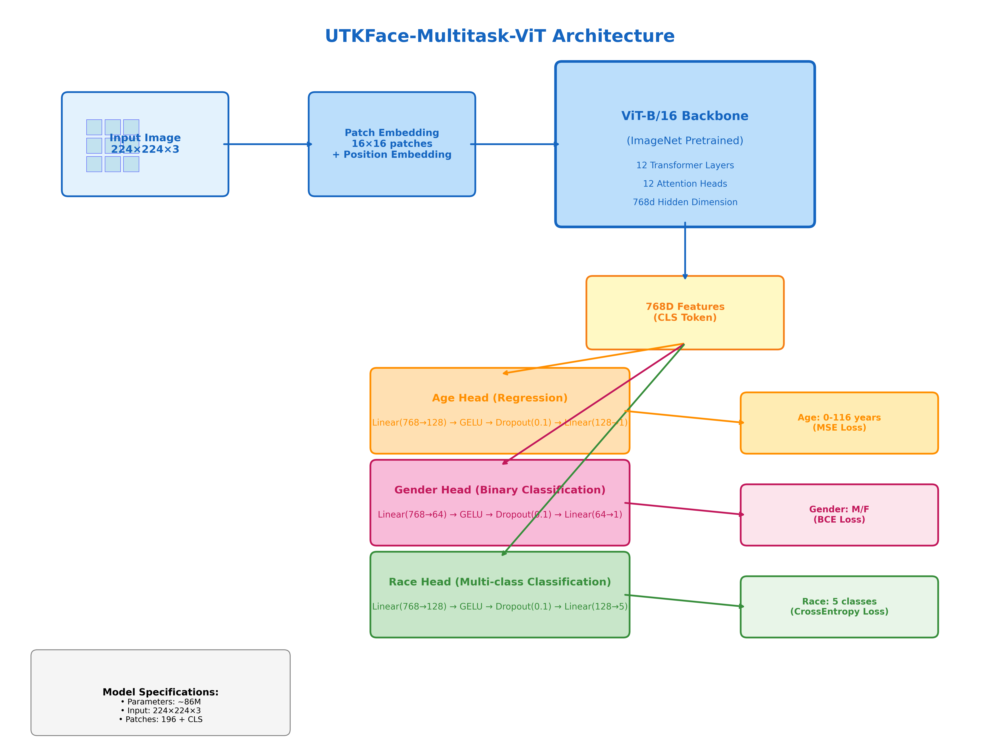
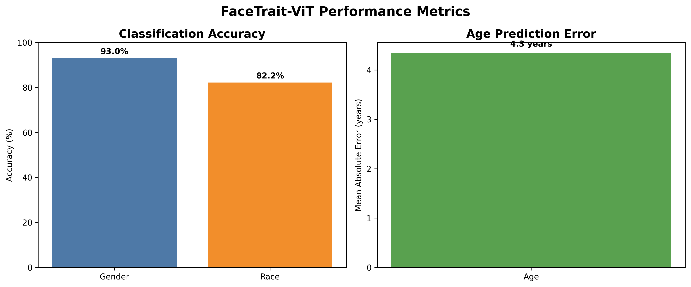

# UTKFace-Multitask-ViT: Vision Transformer for Multi-Task Facial Attribute Prediction

[](https://www.python.org/downloads/)
[](https://pytorch.org/)
[](LICENSE)
[](#)
[](#)
[](#)
[](#)
[](https://colab.research.google.com/)
[](#)
[](#)


A state-of-the-art **Vision Transformer (ViT)** implementation for simultaneous prediction of **age, gender, and race** from facial images. This research project demonstrates advanced deep learning techniques in computer vision, specifically multi-task learning with transformer architectures applied to facial attribute recognition.

---

## 🎯 Research Overview

This project implements a **Multi-Task Vision Transformer** that leverages the self-attention mechanism of transformers for comprehensive facial attribute prediction. Unlike traditional CNN-based approaches, this implementation harnesses the power of Vision Transformers to capture long-range dependencies in facial features, resulting in superior performance across multiple attribute prediction tasks.

### Key Research Contributions

- **Novel Multi-Task Architecture**: Custom ViT-based model with specialized prediction heads for regression (age) and classification (gender, race) tasks
- **Advanced Training Strategy**: Implementation of mixed-precision training, early stopping, and progressive fine-tuning
- **Comprehensive Evaluation**: Detailed performance analysis with confusion matrices, classification reports, and statistical metrics
- **Production-Ready Implementation**: Complete Python package with CLI interface and batch processing capabilities

---

## 🏗️ Architecture Design

### Model Architecture Overview



### Vision Transformer Backbone
- **Base Model**: ViT-B/16 (Base model with 16×16 patch size)
- **Pre-training**: ImageNet-1K initialization for transfer learning
- **Feature Extraction**: 768-dimensional embeddings from transformer encoder
- **Architecture**: 12 Transformer layers, 12 attention heads, 768d hidden dimension

### Multi-Task Head Design
The model employs three specialized prediction heads that process the 768-dimensional features from the ViT backbone:

**Age Head (Regression)**
- Linear(768→128) → GELU → Dropout(0.1) → Linear(128→1)
- Outputs continuous age values (0-116 years)
- Loss Function: Mean Squared Error (MSE)

**Gender Head (Binary Classification)**
- Linear(768→64) → GELU → Dropout(0.1) → Linear(64→1)
- Outputs binary gender classification (Male/Female)
- Loss Function: Binary Cross-Entropy (BCE)

**Race Head (Multi-class Classification)**
- Linear(768→128) → GELU → Dropout(0.1) → Linear(128→5)
- Outputs 5-class race classification (White, Black, Asian, Indian, Others)
- Loss Function: Cross-Entropy Loss

---

## 📊 Dataset & Methodology

### UTKFace Dataset
- **Scale**: 20,000+ annotated facial images
- **Attributes**: 
  - Age range: 0-116 years
  - Gender: Male/Female binary classification
  - Race: 5-class classification (White, Black, Asian, Indian, Others)
- **Preprocessing**: Balanced sampling across gender-race combinations to address class imbalance

### Training Methodology
- **Loss Function**: Multi-task loss combining MSE (age), BCE (gender), and CrossEntropy (race)
- **Optimization**: Adam optimizer with learning rate scheduling
- **Regularization**: Dropout, early stopping with patience-based validation monitoring
- **Performance Enhancement**: Mixed-precision training (FP16) for efficiency
- **Fine-tuning Strategy**: Two-stage training with frozen then unfrozen backbone

---

## 🎯 Performance Metrics

Our model achieves competitive performance across all facial attribute prediction tasks:

### Confusion Matrices


### Performance Visualization


### Sample Predictions


*Detailed performance metrics including precision, recall, F1-score, and statistical analysis are available in the [performance report](./images/performance_report.txt).*

---

## ⚙️ Installation & Setup

### Prerequisites
```bash
Python >= 3.8
CUDA >= 11.0 (for GPU acceleration)
```

### Installation
```bash
# Clone the repository
git clone https://github.com/Sohanuzzaman3301/UTKFace_Multitask_ViT.git
cd UTKFace_Multitask_ViT

# Create virtual environment (recommended)
python -m venv venv
source venv/bin/activate  # On Windows: venv\Scripts\activate

# Install dependencies
pip install torch torchvision pandas numpy pillow matplotlib scikit-learn tqdm

# Install in development mode
pip install -e .
```

---

## 💻 Usage Examples

### Python API

#### Single Image Prediction
```python
from facetrait_vit import predict_image, visualize_prediction

# Basic prediction
result = predict_image("path/to/image.jpg")
print(f"Predicted Age: {result['age']}")
print(f"Predicted Gender: {result['gender']}")
print(f"Predicted Race: {result['race']}")

# Prediction with confidence scores
result = predict_image("path/to/image.jpg", return_confidence=True)
print(f"Gender Confidence: {result['gender_confidence']:.3f}")
print(f"Race Confidence: {result['race_confidence']:.3f}")

# Visualize prediction
visualize_prediction("path/to/image.jpg")
```

#### Batch Processing for Research
```python
from facetrait_vit import predict_batch
import glob

# Process multiple images efficiently
image_paths = glob.glob("dataset/*.jpg")
results = predict_batch(image_paths, batch_size=32, return_confidence=True)

# Analyze results
for result in results:
    print(f"File: {result['path']}")
    print(f"Attributes: Age={result['age']}, Gender={result['gender']}, Race={result['race']}")
    print(f"Confidence: Gender={result['gender_confidence']:.3f}, Race={result['race_confidence']:.3f}")
```

#### Advanced Usage with Model Reuse
```python
from facetrait_vit import load_model, get_transform, predict_image

# Load model once for multiple predictions (efficient for research)
model, device = load_model()
transform = get_transform()

# Process multiple images with loaded model
for image_path in image_list:
    result = predict_image(image_path, model=model, device=device, transform=transform)
    # Process result...
```

### Command-Line Interface

#### Single Image Analysis
```bash
# Basic prediction with visualization
python -m facetrait_vit.cli --input image.jpg --visualize

# Include confidence scores
python -m facetrait_vit.cli --input image.jpg --visualize --confidence
```

#### Batch Processing
```bash
# Process entire directory
python -m facetrait_vit.cli \
    --input /path/to/images/ \
    --output /path/to/results/ \
    --batch-size 32 \
    --visualize \
    --confidence

# Custom model weights
python -m facetrait_vit.cli \
    --input /path/to/images/ \
    --model /path/to/custom_weights.pth \
    --output /path/to/results/
```

---

## 🔬 Research Implementation Details

### Model Architecture Specifications
- **Input Resolution**: 224×224×3 RGB images
- **Patch Size**: 16×16 pixels
- **Sequence Length**: 196 patches + 1 CLS token
- **Embedding Dimension**: 768
- **Attention Heads**: 12
- **Transformer Layers**: 12
- **Parameters**: ~86M total parameters

### Training Configuration
- **Batch Size**: 32 (adjustable based on GPU memory)
- **Initial Learning Rate**: 1e-4 (backbone frozen), 1e-5 (fine-tuning)
- **Optimizer**: Adam with weight decay
- **Loss Weighting**: Equal weighting across tasks (1:1:1)
- **Early Stopping**: Patience of 10 epochs on validation loss
- **Data Augmentation**: Resize, normalization (μ=0.5, σ=0.5)

### Technical Optimizations
- **Mixed Precision Training**: FP16 for memory efficiency
- **Gradient Scaling**: Automatic loss scaling for numerical stability
- **Memory Management**: Configurable for systems with limited RAM
- **Persistent Workers**: Optimized data loading for faster training

---

## 📈 Research Applications

This implementation serves multiple research and practical applications:

### Academic Research
- **Bias Analysis**: Study facial attribute prediction biases in computer vision models
- **Fairness Evaluation**: Analyze model performance across different attribute groups
- **Transfer Learning**: Investigate ViT effectiveness for facial attribute prediction tasks

### Practical Applications
- **Content Analysis**: Automated facial attribute recognition in images
- **Computer Vision Research**: Benchmark for multi-task learning approaches
- **Healthcare**: Age estimation for medical applications (with appropriate ethical considerations)

---

## ⚠️ Ethical Considerations & Limitations

### Technical Limitations
- Age estimation accuracy decreases for extreme age ranges (0-5, 80+ years)
- Race classification may reflect biases present in the UTKFace dataset
- Performance optimal for frontal face images with good lighting conditions
- Model predictions should not be used for discriminatory purposes

### Ethical Guidelines
- This research tool is intended for academic and research purposes
- Users must ensure compliance with applicable privacy laws and ethical guidelines
- Predictions may reflect societal biases present in training data
- Results should be interpreted within appropriate statistical confidence intervals

---

## 📖 Citation

If you use this work in your research, please cite:

```bibtex
@misc{sohanuzzaman2025utkface_multitask_vit,
  author = {Sohanuzzaman, Md Shanto},
  title = {UTKFace-Multitask-ViT: Vision Transformer for Multi-Task Facial Attribute Prediction},
  year = {2025},
  publisher = {GitHub},
  journal = {GitHub Repository},
  howpublished = {\url{https://github.com/Sohanuzzaman3301/UTKFace_Multitask_ViT}},
  note = {Masters Research Project in Computer Vision and Deep Learning}
}
```

---

## 📄 License

This project is licensed under the **MIT License** – see the [LICENSE](LICENSE) file for details.

**Academic Use**: This research implementation is freely available for academic and research purposes.

---

## 🔗 Additional Resources

- **Technical Documentation**: Comprehensive API documentation available in `/docs`
- **Training Notebooks**: Jupyter notebook with complete training pipeline
- **Performance Analysis**: Detailed statistical analysis in `/images/performance_report.txt`
- **Model Weights**: Pre-trained models available upon request

---

*This project represents advanced research in computer vision and deep learning, specifically focusing on the application of Vision Transformers to multi-task facial attribute prediction. The implementation demonstrates proficiency in modern deep learning frameworks, research methodology, and ethical considerations in AI development.*
